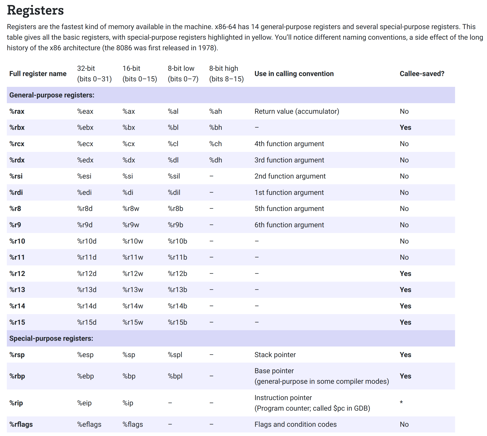

# Default register and operation size

By default, operations are in *quad* `q` mode (8 bytes == 8x8 == 64 bits). Hence, use the appropriate 64 bits registers.



Hence, writing the following program

```x86-64
.globl main
main:
    # prologue (enter new next AR)
    pushq %rbp # save %rbp on the stack
    movq %rsp, %rbp # define %rbp for the current function

    # return 3
    movq	$3, %rax
  
    # epilogue (leave AR)
    popq %rbp # restore %rbp from the stack
    ret # return to the caller (here the shell)
```

Them compiling and executing:

```shell
(base) onyr@aezyr:~/Documents/code/assembly/default_quad$ gcc -O0 quad_specified.s -o qs
(base) onyr@aezyr:~/Documents/code/assembly/default_quad$ ./qs
(base) onyr@aezyr:~/Documents/code/assembly/default_quad$ echo $?
3
```

Is exactly the same as doing:

```x86-64
.globl main
main:
    # prologue (enter new next AR)
    push %rbp # save %rbp on the stack
    mov %rsp, %rbp # define %rbp for the current function

    # return 3
    mov	$3, %rax
  
    # epilogue (leave AR)
    pop %rbp # restore %rbp from the stack
    ret # return to the caller (here the shell)
```

Which also gives:

```shell
(base) onyr@aezyr:~/Documents/code/assembly/default_quad$ gcc -O0 quad_unspecified.s -o qu
(base) onyr@aezyr:~/Documents/code/assembly/default_quad$ ./qu
(base) onyr@aezyr:~/Documents/code/assembly/default_quad$ echo $?
3
```
