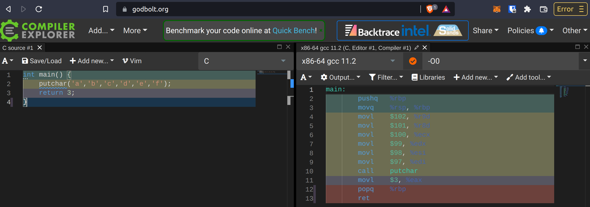
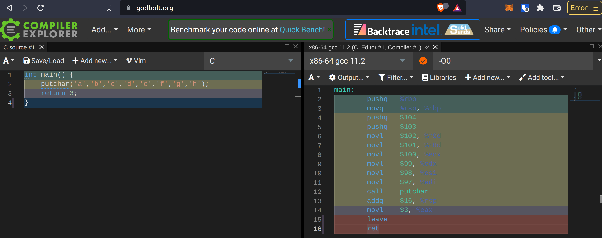

# Function calls

### Useful links

[x86 Disassembly/Calling Conventions](https://en.wikibooks.org/wiki/X86_Disassembly/Calling_Conventions) ⭐️

##### tools

[Godbolt](https://godbolt.org/) 🌟

## Notes

Up to 6 params, we pass those params using registers: %edi, %esi, %edx, %ecx, %r8d, %r9d (mixing `l` and `q` mods), or in `q` (64 bits) mod: %rdi, %rsi, %rdx, %rcx, %r8 and %r9.



But when there are more than 6 params, the remaining parameters needs to be passed through the *stack*.

Note that because we follow the standard ABI of C in x86-64!!!

#### don't confuse x86 and x86-64

WARN: the history standard x86 ABI for function call is called CDECL and specify that "the *calling* function cleans the stack. This allows CDECL functions to have *variable-length argument lists* (aka variadic functions)." [See here](https://en.wikibooks.org/wiki/X86_Disassembly/Calling_Conventions).

So the passage of the first 6 params using registers (which is obviously much faster) is a huge difference between x86 and x86-64!



That's why a program written like so:

```x86-64
(base) onyr@aezyr:~/Documents/code/assembly/function_calls$ gcc -O0 -o putchar putchar.s 
(base) onyr@aezyr:~/Documents/code/assembly/function_calls$ ./putchar 
Segmentation fault (core dumped)
```

Gives a *segfault...*

```shell
(base) onyr@aezyr:~/Documents/code/assembly/function_calls$ gcc -O0 -o putchar putchar.s 
(base) onyr@aezyr:~/Documents/code/assembly/function_calls$ ./putchar 
Segmentation fault (core dumped)
```

Because the function call uses the *stack* directly instead of using the required registers (here `%rdi` / `%edi`, depending on the size mode (64/32 bits)).


## Putchar

This function expects 1 arguments as an int which is intepreted as an ASCII symbol, and prints it to stdout.

Hence, pushing 1 or more arguments will not print more that one char to the standard output.

(Note the `a` printed before the command prompt).

```shell
(base) onyr@aezyr:~/Documents/code/assembly/function_calls$ gcc -O0 -o putchar putchar.s 
(base) onyr@aezyr:~/Documents/code/assembly/function_calls$ ./putchar
a(base) onyr@aezyr:~/Documents/code/assembly/function_calls$ echo $?
3
(base) onyr@aezyr:~/Documents/code/assembly/function_calls$ gcc -O0 -o putchar_more_than_6_args putchar_more_than_6_args.s 
(base) onyr@aezyr:~/Documents/code/assembly/function_calls$ ./putchar_more_than_6_args 
a(base) onyr@aezyr:~/Documents/code/assembly/function_calls$ echo $?
3
```
